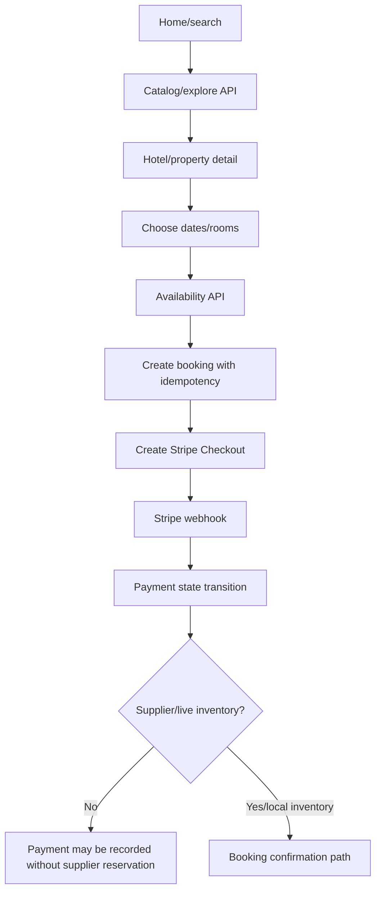

# Application Flows

## Guest

```mermaid
flowchart TD
  A[Open app] --> B{Clerk loaded?}
  B -->|No| C[Splash/loading]
  B -->|Signed out| D[/login]
  D --> E[Browse login/signup or vendor application]
  E --> F[Public catalog/search where route permits]
```

Evidence: `artifacts/travel-land-app/app/index.tsx:4-8`, `app/_layout.tsx:172-201`.

## Customer registration and email login

```mermaid
flowchart TD
  A[Enter email] --> B{Sign up or sign in}
  B -->|Sign up| C[Clerk signUp.create]
  C --> D[Send email code]
  D --> E[/verify]
  E --> F[Verify code]
  F --> G[signUp.finalize]
  B -->|Sign in| H[Clerk signIn.create]
  H --> I[Send email code]
  I --> J[Inline verification]
  J --> K[verify code]
  K --> L[signIn.finalize and activate session]
  G --> M[Device security gate]
  L --> M
  M --> N[/v1/me role resolution]
  N --> O[Customer/vendor/admin home]
```

Evidence: `app/login.tsx:155-227,294-312`, `app/verify.tsx:37-115`, `context/RoleContext.tsx:23-56`.

## Returning session and logout

1. Clerk restores the session.
2. The app loads user-scoped device security state from SecureStore.
3. If setup is incomplete, the user enters biometric/passcode or skips.
4. Role resolution calls `/api/v1/me`.
5. A 401 clears/signs out and returns to login.
6. API logout does not revoke a Clerk session; the client must call Clerk sign-out.

This flow is source/test supported but force-close, resume, and account-switch behavior still need physical-device acceptance.

## Discovery, hotel, booking, and payment



Evidence: `routes/bookings.ts:53-149`, `lib/booking.ts:173-276`, `lib/booking-payments.ts:56-219`, `lib/webhookHandlers.ts:13-34`.

## Property enquiry

Customer selects a property and submits an idempotent enquiry. The API stores the enquiry and user ownership. Vendor updates status and history; notification state is persisted. This is an enquiry workflow, not a purchase, legal verification, or ownership transfer (`routes/catalog.ts:447-510`, `routes/vendor-portal.ts:700-817`).

## Vendor

1. Guest submits application.
2. Admin reviews/approves/rejects.
3. Approved vendor accesses vendor routes.
4. Vendor manages hotels, rooms, date availability, blackouts, prices, bookings, and enquiries.
5. Ownership and approval checks run server-side.

The API flow is real. Mobile vendor screens include placeholders for some modules.

## Admin

1. Clerk signs in.
2. Admin SPA calls `/me`.
3. Non-admin receives an access-denied state.
4. Admin can manage users/vendors/statuses, catalog, moderation, announcements, featured content, audit history, bookings, payments, and reports.

Every flow needs a live environment test for provider errors, network loss, empty records, authorization failures, and notification/email failure. Native-only checks are listed in `TESTING_AND_QA.md`.
