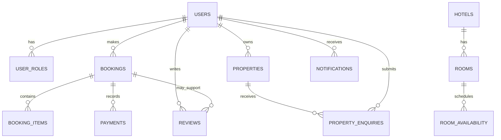

# Database Schema

## Provider and access

- PostgreSQL is accessed through Drizzle (`lib/db/src/index.ts:5-15`).
- `DATABASE_URL` is required at runtime.
- Schema source is under `lib/db/src/schema`.
- No repository migration directory or SQL migration set was found in the inspected paths; deployment must document how schema changes are applied.

## Domain tables

| Domain | Tables / relationships |
|---|---|
| Identity | `users`, `user_roles`, `authentication_sessions` |
| Vendor onboarding | `vendor_profiles`, `vendor_applications`, approval history, admin invitations |
| Identity linking | `identity_link_attempts` |
| Catalog | destinations/images, attractions, events, food places, featured content, audit logs |
| Hospitality | hotels → destination/owner; rooms → hotels; availability → rooms |
| Commerce | bookings → users; booking items → bookings/rooms; payments → booking/user; wallets → users; wallet transactions → wallet/payment |
| Property | properties → owner; property images → properties; enquiries → property/user; enquiry history → enquiry/user |
| Engagement | favorites, reviews → user/optional booking, notifications, push tokens, offers |
| Planning | trips and trip items |

## Integrity controls

The schema uses foreign keys with cascade, restrict, or set-null actions according to ownership and lifecycle. It includes checks for role/status values, coordinates, room capacities/rates/inventory, booking/payment/review/trip states. Several business statuses have weaker or no equivalent DB checks, including some property, wallet transaction, notification, offer, and catalog status fields.

## Risks and questions

- Booking availability is read/calculated before insertion; visible code does not show row locking or an atomic inventory decrement.
- Payment provider/provider-reference uniqueness is not visibly enforced in the schema.
- Payment rows may outlive deleted bookings through set-null behavior; reconciliation/reporting should account for this.
- Schema migration and rollback strategy is not evidenced in the repository.
- Seed/demo data must be isolated from production.

## Relationship diagram

