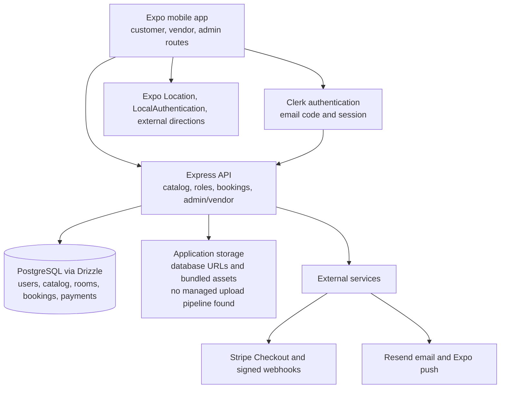

# Travel & Land — Master Application Analysis

**Audit basis:** existing audit documents in `docs/mobile-app-audit/` plus a read-only review of the current source and configuration on 2026-09-22.  
**Scope:** mobile app, API, database schema, admin application, integrations, testing, and release configuration.  
**Changes made:** this report only. No application source, package, database, authentication, API, or deployment configuration was changed.

## Status labels used in this report

| Label | Meaning |
|---|---|
| ✅ Working | The behavior is connected to its intended path and supported by tests or clear execution evidence. |
| 🟡 Partially Working | Important pieces work, but a product, provider, native, or reliability gap remains. |
| 🔵 Demo/Mock | The behavior is deliberately seeded, simulated, local-only, or presentational. |
| 🔴 Broken | The current implementation has a verified failure in its intended path. |
| ⚪ Not Implemented | No usable implementation was found. |

“Working” does not mean “ready for a public production launch.” Provider configuration, live data, and physical-device behavior are called out separately.

---

## 1. App at a glance

### What Travel & Land is

Travel & Land is a travel and property-discovery platform. A customer can discover destinations and attractions, browse hotels and properties, save content, plan trips, submit property enquiries, review eligible stays, receive notifications, and start a hotel booking/payment flow. Vendors can manage approved hospitality inventory and enquiries. Administrators can manage users, vendors, content, bookings, payments, reviews, notifications, featured content, audit history, and reports.

### Who will use it

- **Customer/traveller:** discovers places and stays, manages saved content and trips, enquires about property, and books.
- **Vendor:** applies for access, then manages approved hotels, rooms, availability, bookings, profile information, and enquiries.
- **Administrator:** reviews applications, manages users and vendors, moderates content, and operates the platform.
- **Guest:** can reach authentication, public discovery/application entry points, and selected public catalog paths.

### What has actually been built

This is more than a visual prototype. The repository contains:

- An Expo Router mobile application.
- A Clerk-authenticated Express API.
- A PostgreSQL/Drizzle schema covering identity, catalog, hospitality, bookings, payments, property enquiries, engagement, notifications, trips, and audit data.
- A Clerk-protected admin SPA.
- A substantial vendor/admin API.
- Generated OpenAPI clients and Zod models.
- Stripe Checkout/webhook handling, Resend email delivery, and Expo push delivery attempts.
- Automated unit, route, integration, contract, and demo journey tests.

However, several business capabilities are still staging/demo quality:

- Hotel inventory is local/development inventory, not proven live supplier inventory.
- Payment confirmation does not prove that a supplier reservation was created.
- The map is a provider-free atlas visualization, not a tile-based map service.
- The wallet/travel pass is explicitly a preview with unavailable real data.
- Managed image/file uploads were not found.
- Production release and live provider acceptance are incomplete.

### Platform and readiness summary

| Area | Current position |
|---|---|
| Android | An internal preview APK path exists. Package is `com.arohagroup.travelandland`; version `1.0.0`, version code `3` (`artifacts/travel-land-app/app.json:3-23`). Physical acceptance is still required. |
| iOS | An internal `ios-preview` EAS profile exists. iOS bundle ID is configured, but a production profile and physical-device acceptance are not evidenced. |
| Backend | Broad Express API exists with Clerk, role/ownership checks, database access, booking/payment, admin, and vendor routes. |
| Database | PostgreSQL/Drizzle schema is broad and relational. Production migration, backup, and rollback evidence is incomplete. |
| Authentication | Clerk email-based sign-up/sign-in is the authority. Local device security gates restored sessions. Phone OTP and organization provisioning were not found. |
| Payments | Stripe Checkout and signed webhook processing are implemented, subject to connector/domain/database readiness. Supplier booking fulfillment and refunds are not proven. |
| Production | Not ready for public production release. EAS production configuration, live provider acceptance, physical testing, operational controls, and several security/reliability items remain. |

---

## 2. What is actually working?

| Feature | Status | Real or Demo | Frontend | Backend | Database | Notes |
|---|---|---|---|---|---|---|
| Email registration | ✅ Working | Real Clerk path | Login/verify screens | Clerk integration | Local user provisioning | Email delivery and physical release behavior still need acceptance. |
| Email sign-in/OTP | ✅ Working | Real Clerk path | Login and verification | Clerk token/session verification | Local identity/role | Six-digit email code; not phone OTP. |
| Phone OTP | ⚪ Not Implemented | Not found | Phone fields exist in business forms | No SMS auth provider found | Phone columns are profile/contact data | Do not treat phone fields as phone authentication. |
| Session persistence | ✅ Working | Real Clerk path | Auth context and guarded routes | Clerk bearer verification | Local user/role lookup | Force-close/resume/account-switch behavior needs device testing. |
| Biometric/passcode unlock | 🟡 Partially Working | Real native capability, unverified | LocalAuthentication screens | Not server MFA | SecureStore namespaced by Clerk user | It gates the UI over a valid Clerk session; native behavior is not fully field-tested. |
| Customer home/explore | ✅ Working | Real API, sometimes seeded content | Home/explore screens | Catalog/search routes | Catalog tables | React Query, loading, retry, and refresh handling exist. |
| Destinations/places/events/food | 🟡 Partially Working | API plus seeded/demo data | Detail screens | Catalog routes | Catalog tables | Content quality and production population are environment-dependent. |
| Hotel search | ✅ Working | Real API path | Hotel list/detail | Hotel search/detail/rooms | Hotel/room tables | Mobile hotel list has page controls (`app/hotels.tsx:107`); scale testing remains. |
| Hotel availability | 🟡 Partially Working | Local/development inventory | Date/room selection | Availability service | Room availability/bookings | No proven live supplier inventory. |
| Booking creation | 🟡 Partially Working | Real application flow | Booking screens | Authenticated booking route | Bookings/items | Idempotency and validation exist; supplier reservation is explicitly a development preview. |
| Stripe checkout/payment | 🟡 Partially Working | Real Stripe path; demo rows also exist | Checkout URL/status | Checkout and webhook handlers | Payments/bookings | Payment can be confirmed without a live supplier reservation. |
| Cancellation/refund | 🟡 Partially Working | Local booking state | Booking detail | Cancellation route | Booking/payment rows | Supplier cancellation and refund settlement are not demonstrated. |
| Favorites | ✅ Working | Real API/database | Customer screens | Favorites routes | Favorites table | Requires account/device lifecycle testing. |
| Trips | ✅ Working | Real API/database | Trip screens | Trips routes | Trips/items tables | Offline behavior is not defined. |
| Property listings | 🟡 Partially Working | Real catalog path, possibly seeded | Property detail | Catalog/property routes | Properties/images | Enquiry is not legal verification or a sale. |
| Property enquiry | ✅ Working | Real API/database | Enquiry form/list | Idempotent customer/vendor workflow | Enquiries/history/notifications | Vendor status changes and history are persisted. |
| Reviews | ✅ Working | Real API/database | Review screens | Eligibility/CRUD/moderation | Reviews table | Abuse/rate-limit and live content acceptance remain. |
| Notifications | 🟡 Partially Working | Real DB records; provider-dependent delivery | Notification screens | Read/unread/push registration/broadcast | Notifications/tokens | Expo push failures are handled without rolling back business state. |
| Maps and directions | 🟡 Partially Working | Location is real; map drawing is simulated | Atlas/map screens | Search/location context | Catalog coordinates | `MapCanvas` projects coordinates onto styled views; no tile provider. |
| Wallet/travel pass | 🔵 Demo/Mock | Presentational preview | `app/wallet.tsx` | No wallet hook found | No demonstrated balance flow | The screen says “Balance unavailable” and “Pending real data connection” (`app/wallet.tsx:55-60`). |
| Vendor application | ✅ Working | Real API/database | Application/status screens | Public application + admin workflow | Vendor applications | Requires abuse controls and operational email acceptance. |
| Vendor operations | 🟡 Partially Working | Real backend; partial mobile UI | Vendor screens/dashboard | Ownership/approval-protected API | Vendor/hotel/room/availability | Some mobile modules are foundations/placeholders. |
| Admin operations | ✅ Working | Real API/database | Protected Vite SPA | Admin router and audit actions | Admin/catalog/audit tables | Some content is read-only and some report metrics are unavailable. |
| Image/file uploads | ⚪ Not Implemented | URL fields/bundled assets only | Fallback/bundled imagery | No upload API found | URL arrays only | No verified bucket, signed URL, resizing, or deletion lifecycle. |
| Production release | ⚪ Not Implemented | Preview configuration only | Preview EAS builds | Replit workflow/API | Production environment not evidenced | No production EAS profile or complete launch process is checked in. |

---

## 3. Complete user journey

### Actual current customer journey

```text
Install or open preview build
        ↓
Splash / Clerk session loading
        ↓
Signed out → Login
        ↓
Choose sign in or sign up with email
        ↓
Clerk creates account/session and sends email code
        ↓
Enter six-digit email code
        ↓
Session becomes active
        ↓
Device security setup/unlock gate
        ↓
API /v1/me resolves local role
        ↓
Customer home
        ↓
Explore/search destinations, places, events, food, hotels, or properties
        ↓
Hotel detail → dates, rooms, availability
        ↓
Create booking with idempotency key
        ↓
Stripe Checkout, if payment is available
        ↓
Signed Stripe webhook updates payment state
        ↓
Booking detail / My Bookings
```

Alternative property path:

```text
Property discovery → Property detail → Enquiry form
        ↓
Submit preferred contact method
        ↓
Database enquiry + notification/history
        ↓
Vendor reviews and updates status
```

Actual limitations:

- “Email/Phone Verification” in the intended product language currently means email code verification; phone OTP was not found.
- Biometric/passcode is a local unlock gate, not a Clerk or API authentication factor.
- A successful payment is not the same as a supplier hotel reservation.
- The map presents catalog coordinates on an atlas-style drawing and can open external directions, but does not provide live map tiles.
- A customer can see wallet/travel-pass UI, but balance and transaction data are unavailable.

### Actual vendor journey

```text
Guest submits vendor application
        ↓
Application stored as pending
        ↓
Admin reviews and approves/rejects
        ↓
Approved vendor invitation/access
        ↓
Clerk sign-in
        ↓
Role and approved-vendor checks
        ↓
Vendor dashboard/API
        ↓
Manage hotels, rooms, availability, bookings, profile, enquiries, reports
```

The API supports more vendor operations than the mobile UI currently exposes.

### Actual admin journey

```text
Clerk sign-in
        ↓
Admin SPA calls /me
        ↓
Non-admin → access denied
Admin → dashboard and protected management shell
        ↓
Users, vendors, hotels, rooms, catalog, properties,
bookings, payments, reviews, announcements, featured content,
reports, audit history, settings
```

### Expected future flow

The expected production journey would be:

```text
Install production app
        ↓
Verified Clerk account and explicit customer/vendor role
        ↓
Optional but fully validated device unlock
        ↓
Live tourism catalog and real map provider
        ↓
Live hotel supplier availability
        ↓
Atomic room reservation
        ↓
Stripe payment and server-side reconciliation
        ↓
Supplier confirmation
        ↓
Booking, cancellation, refund, notifications, and support history
```

The largest differences are live supplier fulfillment, atomic reservation correctness, real map/storage capability, refund rules, and production operations.

---

## 4. Authentication

### Clerk

**CURRENT STATUS:** ✅ Working for email-based authentication.  
**WHAT THE CODE DOES:** The mobile app uses Clerk sign-up/sign-in and an email verification code. The API verifies the Clerk identity, provisions or loads a local user, assigns a default `user` role when needed, and sets a local authenticated identity (`artifacts/api-server/src/middlewares/requireAuth.ts:44-88`).  
**WHAT THE USER EXPERIENCES:** Email account creation or sign-in, code entry, then the app routes to the appropriate workspace.  
**WHAT IS MISSING:** Production provider acceptance, complete native lifecycle acceptance, and account deletion.  
**WHAT SHOULD BE IMPROVED:** Keep provider/environment selection explicit and test session restoration, account switching, and expired sessions on physical devices.

### Email, OTP, and phone

**CURRENT STATUS:** Email code is implemented; phone OTP is not implemented.  
**WHAT THE CODE DOES:** Login uses Clerk email flows (`app/login.tsx:155-227`); verification accepts six digits (`app/verify.tsx:37-84`). Phone fields appear in booking/property/vendor forms, but no SMS authentication provider or phone verification flow was found.  
**WHAT THE USER EXPERIENCES:** A customer receives an email code, not a phone code.  
**WHAT IS MISSING:** Phone OTP, if required by the product.  
**WHAT SHOULD BE IMPROVED:** Decide whether phone is a contact field or an authentication requirement before adding another identity flow.

### Session persistence and logout

**CURRENT STATUS:** ✅ Working with Clerk authority; logout semantics are client-controlled.  
**WHAT THE CODE DOES:** The API reports that Clerk verifies/refreshes sessions and that the application does not create or revoke a separate session (`artifacts/api-server/src/routes/auth.ts:63-84`).  
**WHAT THE USER EXPERIENCES:** Signing out must use the Clerk client SDK. A valid Clerk session may still exist while the local device gate is locked.  
**WHAT IS MISSING:** Strong physical-device evidence for force-close, resume, and cross-account state cleanup.  
**WHAT SHOULD BE IMPROVED:** Document the distinction between server authentication and local unlock and add lifecycle acceptance tests.

### Roles

**CURRENT STATUS:** ✅ Working for customer, vendor, and admin separation.  
**WHAT THE CODE DOES:** The local role constraint is `user|vendor|admin`; vendor routes require vendor role and approval, admin routes require admin role, and ownership checks run on the server.  
**WHAT THE USER EXPERIENCES:** Customers, vendors, and admins are routed to different workspaces.  
**WHAT IS MISSING:** Complete vendor mobile screens and a product decision about whether more roles are needed.  
**WHAT SHOULD BE IMPROVED:** Keep role and ownership checks server-side and test every object access boundary.

### Biometric/device authentication

**CURRENT STATUS:** 🟡 Partially Working.  
**WHAT THE CODE DOES:** SecureStore values are namespaced by Clerk user ID. LocalAuthentication is used for device unlock. The app can skip setup, and browser use disables native biometrics.  
**WHAT THE USER EXPERIENCES:** A returning user may unlock the app with Face ID, fingerprint, or device credentials.  
**WHAT IS MISSING:** Proof on physical Android/iOS devices, especially after force-close, account switch, biometric enrollment change, and storage failure.  
**WHAT SHOULD BE IMPROVED:** Keep this as a local convenience/security gate unless product explicitly requires server MFA.

### Organizations and provisioning

**CURRENT STATUS:** No organization/tenant dependency was found in the current authentication path.  
**WHAT THE CODE DOES:** `requireAuth` maps a Clerk user ID to a local user and local roles; vendor access is controlled by vendor profiles, applications, invitations, and approval. The inspected routes do not require a Clerk organization ID or provision organizations.  
**WHAT THE USER EXPERIENCES:** Access is account/role-based, not organization-selection-based.  
**WHAT IS MISSING:** Organization support only if multi-tenant vendor/business isolation becomes a product requirement.  
**WHAT SHOULD BE IMPROVED:** Do not introduce organization provisioning merely because the platform may later support businesses. First decide whether a vendor profile and server ownership model are sufficient.

### Production configuration

**CURRENT STATUS:** 🟡 Partially Working.  
**WHAT THE CODE DOES:** Release guardrails distinguish development/preview and live Clerk configuration, but EAS contains `preview` and `ios-preview` only (`artifacts/travel-land-app/eas.json:1-20`).  
**WHAT THE USER EXPERIENCES:** Internal preview builds are possible; a complete store release path is not demonstrated.  
**WHAT IS MISSING:** Production EAS profile, signing/submission/version policy, and live acceptance.  
**WHAT SHOULD BE IMPROVED:** Build staging first, then create a production profile with explicit live-key/demo rejection.

---

## 5. Application architecture



### Component responsibilities

- **Mobile app:** renders customer, vendor, and admin routes; calls generated API hooks; keeps UI/device state.
- **Clerk:** authenticates the user and provides the identity/session token.
- **API:** verifies identity, maps it to a local account, enforces roles/ownership, validates requests, and coordinates business actions.
- **PostgreSQL/Drizzle:** stores local accounts, roles, catalog, hospitality inventory, bookings, payments, enquiries, reviews, notifications, and audit records.
- **Storage:** currently means database URL fields plus bundled/static assets. A managed object-storage upload system was not found.
- **Stripe:** creates checkout sessions and sends signed payment events.
- **Resend/Expo push:** attempts transactional email and device notifications.
- **Location/device services:** provide foreground location, local biometric/device authentication, and external directions handoff.

---

## 6. API analysis

### APIs currently used by the mobile app

| API area | Used by | Purpose | Authentication | Role | Database | Status |
|---|---|---|---|---|---|---|
| `/api/v1/me` and auth session paths | Mobile root/role context | Resolve current account and role | Clerk | Any active account | Users/roles/vendor profile | ✅ Working |
| Catalog/home/destination/property paths | Home/explore/detail screens | Discovery content | Public or Clerk as required | User for writes | Catalog/properties | ✅ Working / seeded-content dependent |
| Explore/search/filter paths | Explore/maps/hotel search | Search and categories | Public reads | None for reads | Catalog/hotels | ✅ Working |
| Hotel/room/availability paths | Hotel screens/vendor/admin | Read and manage hospitality inventory | Read public; writes protected | Vendor/admin for management | Hotels/rooms/availability | 🟡 Local/development inventory |
| `/api/v1/bookings` paths | Booking screens | Create/list/get/cancel booking | Clerk | Owner/admin | Bookings/items | 🟡 Payment/supplier dependent |
| Checkout path | Booking detail | Start Stripe Checkout | Clerk + idempotency key | Owner | Booking/payment | 🟡 Provider dependent |
| Favorites/trips | Saved/trip screens | Save and organize content | Clerk | Owner | Favorites/trips | ✅ Working |
| Reviews | Review screens | Eligibility and review actions | Clerk | Owner/admin moderation | Reviews | ✅ Working |
| Notifications | Notification screens | Read state/push registration | Clerk | Owner/admin broadcast | Notifications/tokens | 🟡 Delivery dependent |
| Property enquiries | Property/enquiry screens | Submit and track interest | Clerk for customer writes | Customer/vendor | Enquiries/history | ✅ Working |
| Vendor portal | Vendor mobile/admin | Hotel, room, availability, booking, enquiry operations | Clerk | Approved vendor | Vendor/hospitality tables | 🟡 UI/API mismatch |
| Admin portal | Admin SPA | Platform moderation and operations | Clerk | Admin | Broad platform tables | ✅ Working |

### APIs available in the backend but not fully used by the mobile app

- Several vendor management capabilities are available in the API while mobile vendor module screens remain foundations/placeholders.
- Admin has broader management/reporting/audit operations than the customer mobile app consumes.
- Optional live hotel/event provider adapters exist, but no concrete configured provider was found.
- Some report metrics are explicitly unavailable, including page views, returning users, conversion, and payouts.

### APIs called by the mobile app but missing or broken

No major customer API call was proven to have no corresponding backend route in the inspected source. The following are contract or capability mismatches rather than a confirmed mobile crash:

- OpenAPI declares identity-link operations under `lib/api-spec/openapi.yaml:952-999`, but no matching API implementation was found under `artifacts/api-server/src`.
- Wallet/travel-pass UI implies future balance/activity data, but no demonstrated wallet screen data API was found.
- A real map provider is not called because the product currently uses a custom atlas.

### APIs that need improvement

1. Restrict `cors({ credentials: true, origin: true })` to known origins (`artifacts/api-server/src/app.ts:53-54`).
2. Add rate limiting for demo OTP and public vendor application/status lookup.
3. Standardize request validation and bounds instead of route-by-route coercion.
4. Prove atomic/locked inventory reservation under concurrent requests.
5. Add provider-reference uniqueness and webhook replay tests.
6. Resolve OpenAPI/runtime identity-link drift.
7. Separate API readiness from startup migrations/provider backfill and expose operational health clearly.

---

## 7. Database

### Business view of the current entities

| Entity | What it represents | Relationships |
|---|---|---|
| User | A local account mapped to Clerk | Has roles, bookings, favorites, reviews, notifications, trips, enquiries, wallet |
| User role | `user`, `vendor`, or `admin` access | Belongs to user |
| Vendor profile | Business/contact information and approval state | Belongs to user |
| Vendor application | Application before vendor access | Can link to user/reviewer/invitation |
| Destination | A destination/catalog area | Has images and related attractions/hotels/content |
| Attraction/place/event/food | Discoverable tourism content | Catalog records |
| Hotel | Hospitality property | Belongs to destination and owner; has rooms |
| Room | Bookable room type/unit | Belongs to hotel; has availability |
| Room availability | Dates, inventory, blackout/price overrides | Belongs to room |
| Booking | Customer booking request/state | Belongs to user and hotel catalog; has items/payments |
| Payment | Payment state linked to booking/user | May be set-null from booking deletion |
| Property | Land/property listing | Belongs to owner; has images and enquiries |
| Property enquiry | Customer interest in a property | Belongs to property/user; has status history |
| Review | Customer feedback, optionally tied to booking | Belongs to user and may reference booking |
| Favorite | Saved catalog relationship | Belongs to user/content |
| Notification | In-app message/read state | Belongs to user |
| Push token | Device notification token | Belongs to user |
| Trip/trip item | Customer planning data | Belongs to user |
| Audit log | Administrative change history | Records entity/action/revision metadata |
| Wallet/transaction | Schema-level wallet concepts | Current mobile wallet screen is not connected to a demonstrated balance flow |

### Relationship and integrity observations

The schema has explicit foreign keys and a mixture of cascade, restrict, and set-null deletion behavior. It includes useful checks for roles, statuses, room values, coordinates, booking/payment/review/trip state, and other core fields.

Remaining risks:

- The visible booking path calculates availability and then inserts booking data; the inspected code does not prove row locking, serializable isolation, or an atomic inventory decrement.
- Payment provider/provider-reference uniqueness is not visibly database-enforced.
- Payment rows may survive booking deletion through set-null behavior, so reconciliation must handle them.
- Some property, wallet transaction, notification, offer, and catalog status rules rely more on application code than database checks.
- Production migration, backup, and rollback procedures are not evidenced in the repository.
- No major missing foreign-key relationship was proven from the schema review, but provider identity and live supplier reservation relationships remain product/integration gaps rather than simple table gaps.

---

## 8. Real data versus mock data

| Feature | Current data | Real backend? | Real database? | Production ready? |
|---|---|---|---|---|
| Login | Clerk email code/session | Yes | Local identity is provisioned | Provider and device acceptance still required |
| Demo login | Development/preview fixed demo identity and OTP | Development-only | Demo local user/role | No |
| Hotel availability | Local/vendor and development sample inventory | Yes, but not supplier-backed | Yes for local inventory | No live supplier proof |
| Booking | Local booking records with validation/idempotency | Yes | Yes | Partial until supplier fulfillment |
| Payment | Stripe Checkout/webhook plus explicit demo payment rows | Yes for Stripe path | Yes | Provider and reconciliation dependent |
| Maps | Styled atlas geometry and projected catalog points | No map provider | Uses catalog coordinates | No, if live maps are required |
| Property listings | API catalog and URL/image fields | Yes | Yes | Partial; verification/storage incomplete |
| Images | Bundled assets, fallback keys, remote URL arrays | Partial | URL fields | No managed upload lifecycle |
| Notifications | Database records, read state, push attempt | Yes | Yes | Delivery depends on Expo/provider/device |
| Favorites | API/database relationship | Yes | Yes | Yes, with lifecycle testing |
| Reviews | Eligibility, CRUD, moderation | Yes | Yes | Yes, with abuse/scale testing |
| Wallet | Explicit “Balance unavailable” / “Pending real data connection” UI | No demonstrated data path | No demonstrated screen integration | No |

The app can look functional while showing seeded/demo content. Demo seed data includes deterministic destinations, hotels, rooms, properties, bookings, payments, and notifications. Demo payment rows use a `demo` provider and must not be used as evidence of live payment settlement.

One source nuance: a Supabase mobile utility exists in `lib/supabase/src/mobile.ts`, but the audited authentication, storage, and API flows use Clerk, PostgreSQL, and URL/bundled asset handling. The existence of that utility alone is not evidence that Supabase is active in the product.

---

## 9. Security

| Risk | Severity | Current situation | Recommended fix |
|---|---|---|---|
| Credentialed permissive CORS | High | API reflects arbitrary origins with credentials (`app.ts:53-54`) | Use an explicit environment-aware origin allowlist and test preflight/credential behavior. |
| Concurrent inventory oversell | High | Availability is checked before booking insertion; locking guarantee is not visible | Add atomic reservation/locking and a concurrent booking test. |
| Production release controls | High | No production EAS profile or complete live-key/store process | Add production build, version, signing, submit, OTA/runtime, rollback, and acceptance gates. |
| Demo auth boundary | Medium | Demo endpoint is intentionally public but development/preview gated; preview enables demo auth | Enforce production assertions and verify demo cannot appear in release artifacts. |
| OTP/application abuse | Medium | No visible rate limiting on demo OTP or public vendor application/status paths | Add IP/account/device throttling, monitoring, and generic anti-enumeration behavior. |
| Application status enumeration | Medium | UUID plus email returns exact status and not-found distinction | Use a high-entropy status token and minimize disclosure. |
| Payment provider duplicate references | Medium | Correctness relies on application logic; DB uniqueness is not visible | Enforce uniqueness/idempotency invariant and replay tests. |
| API startup dependency chain | Medium | DB/Stripe setup, migrations, managed webhooks, and backfill happen before listen | Separate operational jobs/readiness and add failure/rollback behavior. |
| Input validation inconsistency | Medium | Some routes use direct coercion/body access while others use generated Zod parsing | Standardize schemas, size limits, UUID/date checks, and pagination limits. |
| Native storage/device behavior | Medium | SecureStore and LocalAuthentication paths exist but native lifecycle is not fully field-tested | Test Android/iOS force-close, storage failure, biometric changes, and account switching. |
| File upload security | Low/Medium | No managed upload path currently exists | Before adding uploads, define MIME/size limits, ownership, signed URLs, scanning, and deletion. |

Positive controls include Clerk token verification, server-side role/ownership checks, no-store authenticated responses, Stripe signature verification, log redaction, sanitized API errors, and tests for unauthorized/cross-owner access.

No actual secret, token, password, private key, or connection-string value is included in this report.

---

## 10. Mobile app quality

### UI and navigation

The route structure is broad and separates public authentication, customer tabs, vendor routes, and admin routes. Home, exploration, detail, booking, property enquiry, reviews, notifications, and profile journeys have recognizable screens and retry paths.

### Loading, errors, and empty states

Authentication, secure-storage, role resolution, and home sections have loading/error/retry handling. Home refresh uses `Promise.allSettled`, so one section can fail without preventing every other section from refreshing.

The main user-facing risk is that protected layouts can return `null` while security or role state is loading or unavailable. A user may see a blank area before a higher-level recovery message appears. Replace blank gated states with an explicit loading or recovery screen.

### Network and offline behavior

Network errors have meaningful handling in several flows, but a complete offline browsing, cached-data, queued-enquiry, or booking-retry policy was not found. A travel app needs an explicit answer for what remains usable without connectivity.

### Android and iOS

The configuration includes Android location/biometric permissions and iOS Face ID permission text. Automated tests cover routing and mocked native behavior, not all real prompts, permission settings, external map launching, push delivery, or release authentication. Both platforms require physical acceptance.

### Performance and images

React Query provides client caching. The mobile hotel screen has pagination, which corrects the earlier broad audit wording that treated pagination as wholly absent. Large-list, image-size, startup, memory, and production-scale API measurements are still missing. Bundled/fallback images avoid an upload dependency but do not provide a scalable media pipeline.

### Accessibility and compatibility

Some controls have accessibility roles and labels, including map markers. A full screen-reader, contrast, touch-target, font-scaling, reduced-motion, tablet, and small-screen audit is not evidenced. The app configuration says `supportsTablet: false` for iOS, so tablet support is not a current target.

### Biggest user problems

1. A blank protected screen can be hard to distinguish from a slow or broken app.
2. The atlas may be mistaken for a live map.
3. The wallet looks like an account feature but clearly has no live balance.
4. A paid booking may not mean a supplier reservation.
5. Vendor navigation advertises capabilities whose mobile screens are not all complete.
6. Offline expectations are unclear.

---

## 11. Production readiness

| Area | Ready? | Why |
|---|---:|---|
| Authentication | [ ] | Clerk path exists, but live configuration, lifecycle, recovery, and physical-device acceptance are incomplete. |
| Authorization | [x] with release testing | Server role/ownership checks are implemented and tested; production origin/environment testing remains. |
| Database | [ ] | Schema is broad, but production migration, backup, rollback, and concurrency evidence are incomplete. |
| APIs | [ ] | Broad API exists, but CORS, rate limits, contract drift, validation consistency, and readiness behavior need work. |
| Payments | [ ] | Stripe path is substantive, but live connector/webhook acceptance and reconciliation are not proven. |
| Bookings | [ ] | Booking flow exists, but local inventory and supplier confirmation/concurrency remain unresolved. |
| Storage | [ ] | No managed upload, bucket, signed URL, or orphan cleanup pipeline was found. |
| Notifications | [ ] | DB notifications work; email/push delivery and physical-device acceptance are provider-dependent. |
| Security | [ ] | CORS and abuse controls are unresolved. |
| Android | [ ] | Preview APK path exists; production profile and physical acceptance are missing. |
| iOS | [ ] | Preview profile exists; production profile, signing/submission, and physical acceptance are missing. |
| Testing | [ ] | Automated coverage is strong, but native/live/provider/concurrency coverage is incomplete. |
| Monitoring | [ ] | Structured logging exists; complete production monitoring, alerting, crash reporting, and SLOs are not evidenced. |
| Backup | [ ] | Database backup and restore process is not evidenced. |
| Error handling | [x] with operational gaps | Sanitized errors and many retry states exist; startup/readiness and provider failures need operational testing. |

This checklist intentionally does not produce a numeric score.

---

## 12. Top problems to fix

### P0 — Must resolve before production

#### P0-1: Establish a real production release path

- **Problem:** EAS defines preview profiles but no production profile, submit/update policy, runtime version, or rollback process.
- **Why it matters:** A buildable APK is not a controlled store release.
- **Current implementation:** `artifacts/travel-land-app/eas.json:1-20` and static versions in `app.json`.
- **Affected feature:** Android/iOS release.
- **Recommended solution:** Define production environment, signing, version increment, store submission, OTA compatibility, rollback, and live-key/demo guardrails.
- **Dependencies:** Product release owner, production Clerk/provider environments.
- **Complexity:** Medium.

#### P0-2: Make booking inventory concurrency-safe

- **Problem:** The source does not prove that two simultaneous requests cannot reserve the same inventory.
- **Why it matters:** Overselling causes financial, operational, and trust damage.
- **Current implementation:** Availability and booking transaction/idempotency paths exist, but visible code does not prove locking/atomic decrement.
- **Affected feature:** Hotel booking.
- **Recommended solution:** Choose and test row locking, serializable reservation, or atomic inventory decrement; add concurrent integration tests.
- **Dependencies:** Database strategy and supplier contract.
- **Complexity:** Large.

#### P0-3: Restrict credentialed API origins

- **Problem:** CORS reflects arbitrary origins while allowing credentials.
- **Why it matters:** It broadens the cross-origin credential attack surface.
- **Current implementation:** `artifacts/api-server/src/app.ts:53-54`.
- **Affected feature:** All authenticated API access.
- **Recommended solution:** Use an explicit environment-specific allowlist and test mobile/admin web origins.
- **Dependencies:** Confirm approved origins.
- **Complexity:** Small/Medium.

#### P0-4: Prove live payment and supplier truth

- **Problem:** Stripe payment can be recorded while supplier reservation remains a development preview.
- **Why it matters:** Customers may pay without receiving a confirmed stay.
- **Current implementation:** Booking response explicitly says supplier reservation remains a development preview (`routes/bookings.ts:53-58`).
- **Affected feature:** Booking/payment.
- **Recommended solution:** Integrate and test live supplier reservation, confirmation, cancellation, refund, reconciliation, and failure recovery.
- **Dependencies:** Supplier selection and commercial rules.
- **Complexity:** Large.

### P1 — Important

#### P1-1: Add rate limiting and anti-enumeration controls

Protect demo OTP, vendor application, and application status paths. Complexity: Medium.

#### P1-2: Complete production database operations

Document migration, backup, restore, rollback, retention, and environment isolation. Complexity: Medium.

#### P1-3: Resolve OpenAPI/runtime identity-link drift

Either implement the declared operations or remove/regenerate the contract and generated clients. Complexity: Medium.

#### P1-4: Complete physical Android/iOS acceptance

Test email verification, force-close/resume, device unlock, location permission states, external directions, push, deep links, and payment return flow. Complexity: Large.

#### P1-5: Replace blank protected states

Show loading, retry, and sign-out recovery instead of only returning `null` in gated layouts. Complexity: Small.

### P2 — Improvement

- Standardize Zod validation, bounds, and pagination.
- Add image CDN/resize/thumbnail handling.
- Complete mobile vendor module screens.
- Define offline discovery and failed-action behavior.
- Add production-scale performance and database query measurements.
- Add accessibility and font-scaling acceptance.

### P3 — Future enhancement

- Real map provider with pan/zoom/tiles if required.
- Wallet/travel credits and transaction history.
- More advanced admin reporting.
- Organization/tenant model, only if the business requires multi-company isolation.
- Rich supplier and property communication features.

---

## 13. Recommended development sequence

This sequence follows dependencies discovered in the codebase rather than the order of the original feature wish list.

### Step 1 — Confirm product decisions

Decide whether phone OTP, organizations, live maps, wallet credits, property verification, and supplier hotel booking are required. These decisions prevent building the wrong infrastructure.

### Step 2 — Secure the existing foundation

Restrict CORS, add abuse controls, preserve server role/ownership checks, enforce demo boundaries, and standardize sensitive logging/error behavior.

### Step 3 — Create staging and production operations

Establish production EAS profiles, environment separation, database migration/backup/rollback procedures, live Clerk/Stripe/Resend setup, monitoring, and readiness checks.

### Step 4 — Make API/database contracts reliable

Resolve OpenAPI drift, standardize validation, add pagination limits, enforce payment identity invariants, and test database concurrency.

### Step 5 — Choose and integrate real tourism/hotel data

Populate content with an explicit data ownership process. Select a hotel supplier and define availability, reservation, cancellation, refund, and reconciliation contracts.

### Step 6 — Make booking and payment one reliable business transaction

Test duplicate taps, retries, webhook replay, amount/currency mismatch, payment failure, supplier failure, cancellation, and refund behavior.

### Step 7 — Complete vendor and property workflows

Finish vendor mobile screens, add managed media storage if required, define property verification, and connect enquiry follow-up to operational ownership.

### Step 8 — Complete notifications and customer trust features

Validate email/push delivery, notification preferences, deep links, booking updates, and support/recovery messaging.

### Step 9 — Improve mobile quality and scale

Add offline rules, accessibility acceptance, image optimization, large-list profiling, query tuning, and physical Android/iOS coverage.

### Step 10 — Release in stages

Run internal preview, closed staging, controlled production rollout, monitoring, rollback rehearsal, and post-release payment/booking reconciliation.

---

## 14. Questions that must be answered before development continues

1. Is the provider-free atlas acceptable, or is a live map provider required?
2. Is phone OTP required, or are phone numbers only contact fields?
3. Is organization/tenant functionality actually required, or are vendor profiles and role ownership sufficient?
4. Should customers and vendors share the same Clerk authentication authority and application, as they do now?
5. Which hotel supplier will provide live availability and reservation fulfillment?
6. What are the cancellation, refund, payment-failure, and supplier-failure rules?
7. Should a payment ever be captured before supplier confirmation, and if so, how is the customer protected?
8. What is the production payment provider/account and who owns webhook operations?
9. Where should property, hotel, profile, and document images be stored?
10. Which catalog and property data is managed by admins, vendors, suppliers, or another content team?
11. What notifications are mandatory, and what delivery guarantees are required?
12. Is the wallet a real financial/credit ledger, a rewards system, or only a future travel-pass concept?
13. Is account deletion required, and what data-retention rules apply?
14. Which Android/iOS versions and device sizes are official launch targets?
15. What database backup, restore, uptime, and incident-response commitments are required?

---

## 15. Final executive summary

### BUILT

Travel & Land has a real Expo mobile app, Clerk-authenticated Express API, PostgreSQL/Drizzle data model, protected admin SPA, vendor backend, generated API contract, booking/payment path, catalog/discovery features, favorites, trips, reviews, notifications, property enquiries, and automated tests.

### WORKING

Email-based Clerk sign-up/sign-in, local account provisioning, server role/ownership checks, customer discovery APIs, favorites, trips, property enquiries, reviews, admin operations, vendor backend controls, Stripe webhook signature handling, and automated source-level test coverage are verified.

### PARTIALLY WORKING

Device unlock, hotel availability, bookings, payments, cancellations, notifications, property operations, vendor mobile UI, maps, production configuration, and database operations all need additional provider, native, concurrency, or operational work.

### DEMO/MOCK

Demo authentication, seeded demo catalog/payment records, development hotel inventory, provider-free atlas drawing, bundled/fallback images, and the wallet/travel-pass preview are not evidence of live production capability.

### BROKEN

No broad customer journey was classified as definitively broken from the inspected source. The most serious verified defects are security/operational risks rather than a demonstrated universal crash: permissive credentialed CORS, incomplete production release controls, and unproven concurrent inventory safety. Blank protected states are a significant UX failure mode when loading or recovery does not resolve clearly.

### MISSING

Production EAS release path, physical-device acceptance, live hotel supplier fulfillment, complete payment-to-reservation reconciliation, managed file storage/uploads, account deletion, phone OTP if required, database backup/rollback evidence, comprehensive monitoring, and any organization model if the business needs multi-tenant isolation.

### SECURITY CONCERNS

The highest concerns are credentialed arbitrary-origin CORS, missing visible rate limiting for OTP/application paths, application status enumeration, unproven booking concurrency protection, payment provider-reference uniqueness, demo-boundary isolation, and incomplete production operations. Positive controls include Clerk verification, server-side authorization, signed Stripe webhooks, log redaction, no-store private responses, and sanitized errors.

### PRODUCTION BLOCKERS

Do not launch publicly until production release controls, trusted-origin policy, live provider and supplier behavior, payment/booking reconciliation, database operations, physical Android/iOS testing, monitoring, backups, and failure recovery are accepted.

### NEXT DEVELOPMENT STEPS

First confirm product decisions, then secure the current API and demo boundaries, establish production/staging operations, make API/database contracts and booking concurrency reliable, integrate live supplier data, complete payment reconciliation, finish vendor/property workflows, validate notifications, and perform physical-device and production-scale acceptance before staged release.