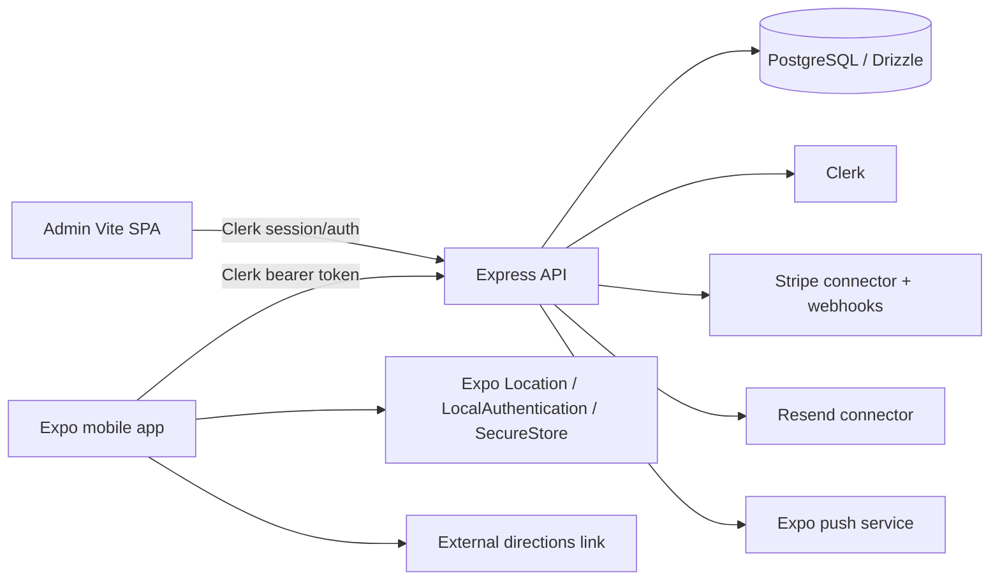

# System Architecture

## Mobile architecture

The root Expo layout composes Clerk, device security, React Query, app state/favorites, and role resolution (`artifacts/travel-land-app/app/_layout.tsx:205-237`). File-based routes separate public auth, customer tabs, vendor workspace, and admin workspace. Protected layouts wait for authentication, device security, and role state before rendering.

## API architecture

Express mounts the raw Stripe webhook before JSON parsing, then CORS, Clerk middleware, parsers, routers, and centralized error handling (`artifacts/api-server/src/app.ts:21-66`). Route modules are separated by catalog, explore, hotel, booking, notification, review, onboarding, auth, vendor, admin, and reports responsibilities.

## Identity and authorization

Clerk is authoritative. `requireAuth` verifies the Clerk identity, provisions/loads the local user, assigns default roles where appropriate, rejects inactive users, and places the local user on the request (`artifacts/api-server/src/middlewares/requireAuth.ts:44-95`). Role and ownership middleware then protect vendor/admin/object access.

## Database

The schema is Drizzle/PostgreSQL. Major domains are platform identity/roles/vendors, catalog, hotels/rooms/availability, bookings/payments/wallet, properties/enquiries, favorites/reviews/notifications, trips/offers, and audit history. No repository migration directory was found in the inspected paths; runtime expects an externally provisioned database.

## Payments

Booking checkout creates Stripe Checkout state with idempotency and metadata. Stripe webhooks verify signatures and apply monotonic payment transitions. The application explicitly does not claim that payment equals a supplier reservation.

## Deployment

Replit workflows run API, mobile Expo, admin, mockup, and validation processes. Mobile EAS has preview profiles only. API startup performs database/Stripe setup before listening, which makes connector and database readiness part of application availability.
